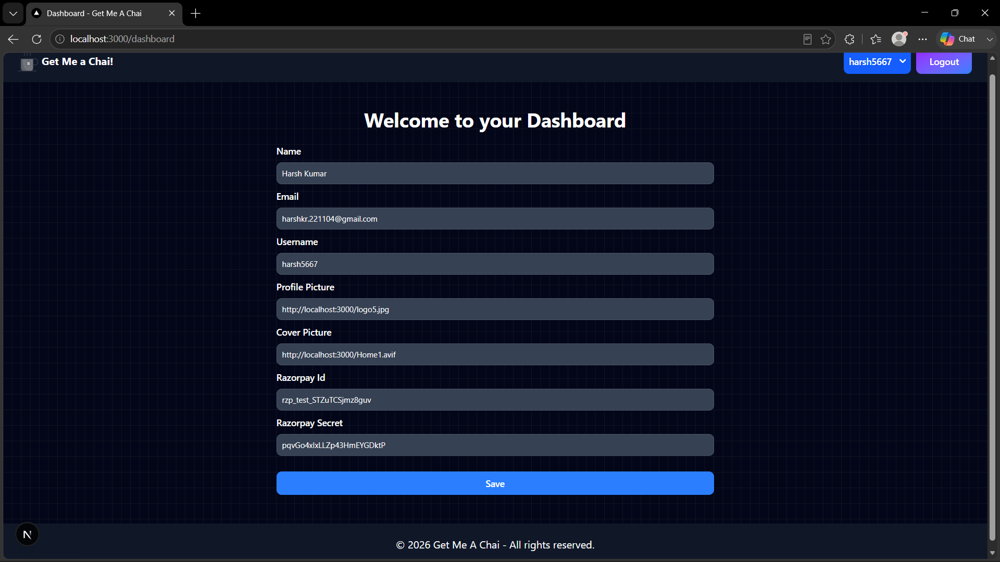
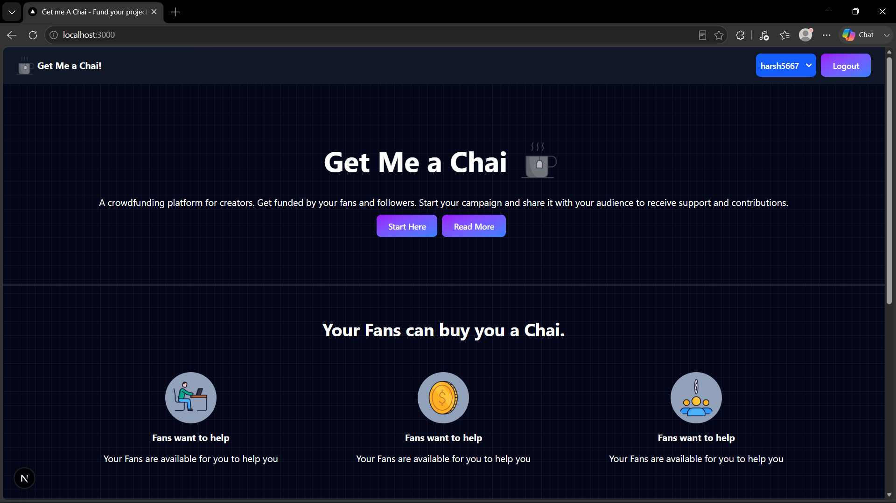

# 🍵 Get Me A Chai!

Get Me A Chai is a premium crowdfunding platform built on **Next.js** and **Tailwind CSS**. It is designed specifically for developers, designers, and creators to receive direct support, tips, and donations from their audience. Users can log in, personalize their profiles, input their payment gateway keys, and showcase a sleek supporter leaderboard.

---

## 🌟 Key Features

*   **OAuth Authentication**: Secure authentication via **NextAuth.js** utilizing **Google** and **GitHub** providers.
*   **Personalized Creator Pages**: Dynamic route layouts (`/[username]`) with customizable profiles, cover images, profile avatars, and bios.
*   **Leaderboard Tracking**: A live leaderboard displaying the top 10 supporters ranked by donation amounts.
*   **Seamless Payments**: Built-in payment gateway integration using **Razorpay Checkout API** for safe, secure, and fast transactions.
*   **Creator Dashboard**: A settings page `/dashboard` allowing creators to update personal info, profile pictures, cover images, and configure their unique payment keys.
*   **Robust Server Actions**: Optimized backend calls using React Server Actions for Mongoose connection, payments initialization, and profile updates.

---

## 🛠️ Technology Stack

*   **Frontend & Routing**: [Next.js](https://nextjs.org/) (App Router, React 19)
*   **Styling**: [Tailwind CSS v4](https://tailwindcss.com/)
*   **Database**: [MongoDB](https://www.mongodb.com/) via [Mongoose ODM](https://mongoosejs.com/)
*   **Authentication**: [NextAuth.js](https://next-auth.js.org/)
*   **Payment Gateway**: [Razorpay API Node SDK](https://razorpay.com/)
*   **Toast Notifications**: [React-Toastify](https://fkhadra.github.io/react-toastify/)

---

## 📂 Project Structure

```text
├── actions/             # React Server Actions
│   └── useractions.js   # User profiles & Razorpay payments initiation logic
├── app/                 # Next.js App Router pages & API routes
│   ├── [username]/      # Dynamic page for supporter checkouts
│   ├── about/           # Info page about the platform
│   ├── api/             # API routes
│   │   ├── auth/        # NextAuth API configuration
│   │   └── razorpay/    # Webhook handler for verification of payment signatures
│   ├── dashboard/       # Creator settings panel
│   ├── login/           # Secure login portal
│   ├── globals.css      # Core styles & Tailwind directives
│   ├── layout.js        # Global layout shell (body backdrop, layout, context)
│   └── page.js          # Interactive homepage with responsive widgets
├── components/          # Reusable React components
│   ├── Dashboard.js     # Settings form component
│   ├── Footer.js        # Page footer branding
│   ├── Navbar.js        # Responsive mobile-friendly navigation bar
│   ├── PaymentPage.js   # Checkout card, payment options, and leaderboard
│   └── SessionWrapper.js# Next-Auth Session provider context wrapper
├── db/                  # Database scripts
│   └── connectDb.js     # Mongoose connection logic with connection pooling
├── models/              # Mongoose DB schemas
│   ├── Payment.js       # Transaction logs, amount, sender, and verification status
│   └── User.js          # Authenticated user profiles and Razorpay credentials
├── public/              # Static media files (logos, gifs, templates)
└── package.json         # Build scripts, configurations, and dependencies
```

---

## ⚙️ Environment Variables Setup

Create a `.env.local` file in the root directory and add the following:

```env
# Next.js Public URI (e.g. http://localhost:3000 for local development)
NEXT_PUBLIC_URI="http://localhost:3000"

# MongoDB Connection String
MONGODB_URI="your_mongodb_connection_uri"

# NextAuth Secret
NEXTAUTH_SECRET="your_nextauth_jwt_signing_secret"

# NextAuth OAuth Credentials
GOOGLE_CLIENT_ID="your_google_oauth_client_id"
GOOGLE_CLIENT_SECRET="your_google_oauth_client_secret"
GITHUB_ID="your_github_oauth_client_id"
GITHUB_SECRET="your_github_oauth_client_secret"
```

---

## 🚀 Local Installation & Quickstart

To run the application locally on your machine, follow these steps:

### 1. Clone the Repository

```bash
git clone https://github.com/yourusername/get-me-a-chai.git
cd get-me-a-chai
```

### 2. Install Dependencies

Using npm to download application dependencies:

```bash
npm install
```

### 3. Run the Development Server

Start the Next.js local development process:

```bash
npm run dev
```

Open [http://localhost:3000](http://localhost:3000) in your web browser to view the application.

### 4. Create Production Build (Optional)

Generate optimized production bundles:

```bash
npm run build
npm start
```

---

## Screenshots

Add your screenshots to:

- `public/screenshots/`

Then update or keep the sample links below.

### Dashboard page



### Home Page 1 



## 🛡️ License

Distributed under the MIT License. See `LICENSE` for more information.
